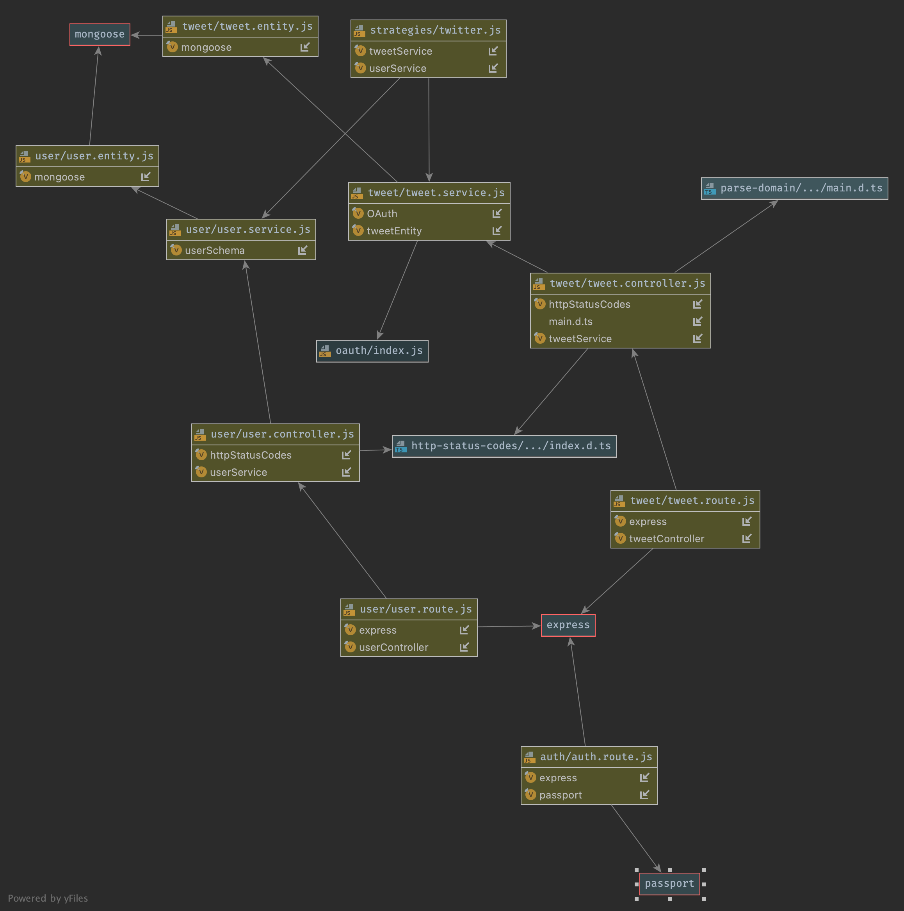
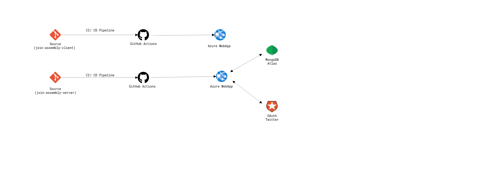

## How to Run the Project
The Project is hosted on Azure Cloud, and is accessible at https://join-assembly-client.azurewebsites.net/ 

### Server
- Clone the Server Repo (https://github.com/arunselvakumar/join_assembly_assignment_server).
- Navigate to cloned repo, and run npm install to install all the dependencies.
- Run npm run start:dev to run in watch mode.
- The server will be alive in port 3000.

### Client
- Clone the Client Repo (https://github.com/arunselvakumar/join_assembly_assignment_client).
- Install NG CLI (npm install -g ng)
- Navigate to cloned repo, and run npm install to install all the dependecies.
- Run ng serve to run in watch mode.
- The server will be alive in port 4200.

## Live Preview
.gif)

## Class Diagram (Server)

## CI/ CD Pipeline

## Credits
http://www.cloudskew.com (For CI/CD Pipeline Diagram)
